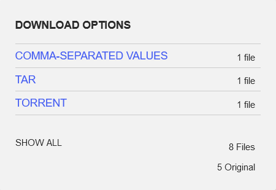
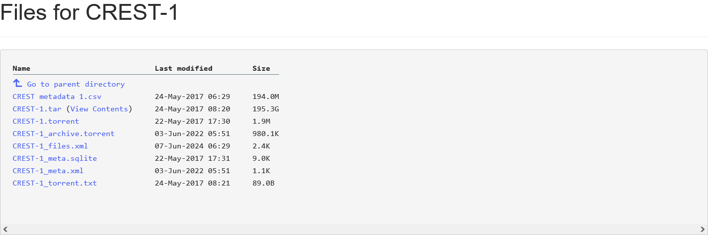

# National-Security-Internet-Archive-NSIA
The National Security Internet Archive focuses on files collected from That 1 Archive, MuckRock, NARA, the National Security Archive at GWU, Hood College, 
the Black Vault, the Government Attic, Paperless Archives, Ernie Lazar, the International Center for 9/11 Studies as well as various other historians, 
collectors and activists.

--------------------------------------------------------------------------------------------------------------------------------------------------------------
* To use 'national security archive online viewer.html' just double click from desktop , this will enable remote viewing via iframe.
* To visit internet.org national security archive in your browser double click the 'Central Intelligence Agency.url' from this repo.
* Files can be dowloaded direct from internet archive or using the commandline interface found here : https://github.com/jjjake/internetarchive
* Clone the above repo ' https://github.com/jjjake/internetarchive.git '
* In the directory of the cloned repo type 'pip install internetarchive' to install the CLI
* To download files use 'ia download' command followed by the filename .
* Example : 'ia download nationalsecurityarchive-weisberg '  will create a folder and download the files to that folder.
* To find the file name , use the name at the end of the urlstring 'https://archive.org/details/ 'in your browser address bar.
* In the above example 'https://archive.org/details/nationalsecurityarchive-weisberg' = 'ia download nationalsecurityarchive-weisberg'
-----------------------------------------------------------------------------------------------------------------------------------------------------------
  

    Click 'show all' to go to downloads page
--------------------------------------------------------------------------------------------------------------------------------------------------------------
 

    Click links to download files

-------------------------------------------------------------------------------------------------------------------------------------------------------------
The archive is a treasure trove of declassified data including :

* U.S. State Department
* Central Intelligence Agency collection
* Office of Strategic Services
* Weisberg Collection on the JFK Assassination
* FBI Files
* Nazi War Crimes
* Department of Defense
* National Security Agency (NSA) Archive
* Project Blue Book
* September 11 Collection
* STARGATE files
* MKULTRA files
* Donald Trump Archive
* Watergate
* Operation SOLO
* Nikola Tesla's - All Published + Declassified Military Scientific Papar Abstracts, FBI Documentation and More
* Jonestown FBI Files
* CIA UFO Documents
* WikiLeaks Archive 2006-2014 (~115GB uncompressed)
* Creation of the CIA
* INSCOM Dossiers
* British UFO Files
* WTC Architectural Drawings Dated Aug 31 1967
* 8,000 pages of Declassified Canadian UFO Documents
* Nelson Mandela
* Australian UFO Files
* Lee Harvey Oswald
* A Psychological Analysis of Adolf Hitler
* Pfeiffer Nuclear Weapon And National Security Archive
* HUMAN PARANORMAL CAPABILITIES (LN734-85)
* Stuxnet code
* Abbie Hoffman FBI Files
* 7,000 Hillary Clinton Emails, Personal Server
* Iranian Hostage Rescue Attempt
* National Knights of the KKK
* Assassination Information Bureau
* Swedish Ghost Rockets
* Cambridge Five
* Pearl Harbor Hearings
* Pentagon Papers
* Anarchist Cookbook, 1971-1999
* Communist Infiltration Motion Picture Industry
* CIA Vietnam Historical Files
* Albert Einstein FBI Files
* FBI Break-ins, Wiretaps and Bugs
* Voynich Manuscript: An Elegant Enigma
* ICEBERG
-----------------------------------------------------------------------------------------------------------------------------------------
 
The total size on disk is : Storage_size 20.6 TB (in 32,078,290 files)

-----------------------------------------------------------------------------------------------------------------------------------------
Links created by 'Distributed denial of secrets' URL: http://ddosxlvzzow7scc7egy75gpke54hgbg2frahxzaw6qq5osnzm7wistid.onion

----------------------------------------------------------------------------------------------------------------------------------------
